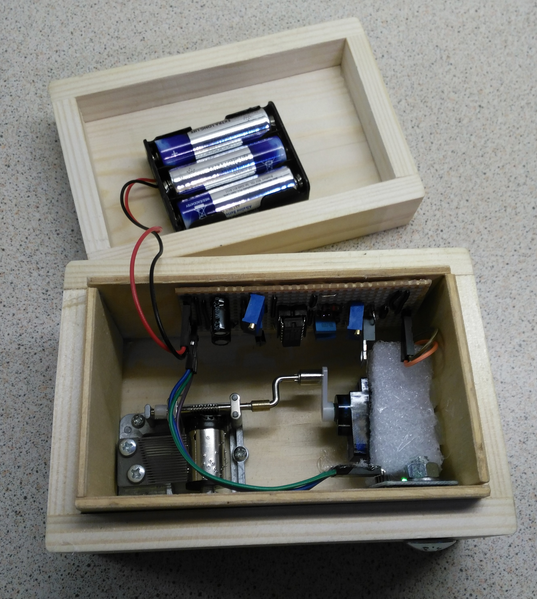

# HackSpace

Files to go with the Tutorials on HackSpace Magazine

## XMAS

Building a Bluetooth remote controlled Christmas light show

This project combines simple woodworking with electronics to produce a remote control Christmas decoration. Get yourself in the Christmas spirit from the comfort of your own armchair. The skills and techniques of this project can be used in a wide range of other projects.
The decoration is in the form of the 4 letters of XMAS. These are filled with green and red LEDs which are controlled by an Arduino.

https://hackspace.raspberrypi.org/issues/1

## MUSIC BOX

Marvellous mechanical music box

Another combination of woodwork and electronics, this time with no coding. Two 555 timers provide a monostable and astable to control a modified servo to drive a mechanical music mechanism. The stripboard design was done using KiCAD based on the following article.

https://hackspace.raspberrypi.org/issues/2 + https://hackspace.raspberrypi.org/features/the-book-of-making-volumn-1-out-now

https://hobbylad.wordpress.com/2013/04/26/designing-professional-looking-stripboards-using-kicad/ 

## GRINDER BOX

A silver soldered metal storage box to stop my angle grinder cables from being nibbled by mice.
Designed in Fusion360 and build using simple hand tools.

Font stencil from Jayde Garrow 
https://www.dafont.com/army-rust.font

https://hackspace.raspberrypi.org/issues/3 + https://hackspace.raspberrypi.org/features/the-book-of-making-volumn-1-out-now

## HACK SPACE SIGN

An EL Wire sign that lights up when there are people moving about in the room
Controlled using CircuitPython and an AdaFruit Trinket
Ultrabright EL Wire and drivers from EL Wire Craft

https://learn.adafruit.com/adafruit-trinket-m0-circuitpython-arduino/overview

https://hackspace.raspberrypi.org/issues/7 + https://hackspace.raspberrypi.org/features/the-book-of-making-volumn-1-out-now

## ROBOTIC WATER SENTRY

The robot water sentry uses the Google AIY Vision kit to detect humans an squirt them with water.

To make it easy to turn on and off there's a Pimoroni On/Off shim. After further research it was concluded that the default installer for this works just fine.

https://shop.pimoroni.com/products/onoff-shim

https://hackspace.raspberrypi.org/issues/9 + https://hackspace.raspberrypi.org/features/the-book-of-making-volumn-1-out-now

See also https://github.com/Workshopshed/JumboServo

## MONKEY SKULL BOWL

A simple project using the AdaFruit Gemma M0. Take care not to burn yourself when making the jewelled LED eyes.

https://hackspace.raspberrypi.org/issues/12

## KNIFE SWITCH

Unleash your inner mad scientist with this remote controlled knife switch. Using an Energenie remote control.

https://github.com/learn2develop/Arduino_Energenie_Pimote

https://hackspace.raspberrypi.org/issues/13

## ROUTER TRAY

When working with small components one of the best ways to store them for easy access is a shallow tray. So this project is a useful storage project made using a handheld router.

https://hackspace.raspberrypi.org/issues/13

## REMOTE DISPLAY

Show info and status from your home automation system with a low powered E-Ink display.

